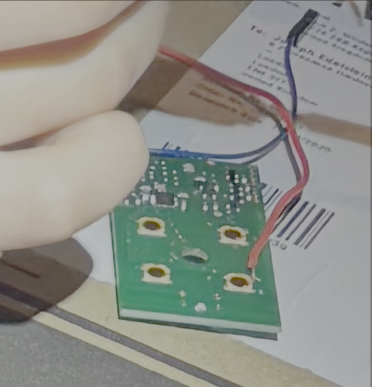

# Gate Control Project
This is a project to allow me to control our gate via the Internet as the gate
controller is a proprietary system that can't be hooked up to the net.  

I am documenting this mainly so I have all the details in case I need to update
something.  If sombody finds it usfull that would be great.


This project consists of two main components:
- **gate-remote**: A Raspberry Pi service that controls physical gate 
  operations via GPIO to a real remote that is wired in to the Pi.  It receives
  commands via MTTQ and simulates button presses on the remote. 
- **gate-app**: A react native app to replicate the functions of the remote by 
  sending commands via MTTQ to the gate-remote app.

## Components

### Hosting
MQTT using free tier on [HiveMQ](https://www.hivemq.com/)

you will need to modify gate-remote and gate-app to point at your own instance 
or an alternative provider. Note app uses MQTT 5 to get acks for commands.

Currently web hosting on [netlify](https://app.netlify)
#### Build settings

| Setting             | Value                       |
| ------------------- | --------------------------- |
| Runtime             | Not set                     |
| Base directory      | /gate-app                   |
| Package directory   | Not set                     |
| Build command       | npx expo export             |
| Publish directory   | /gate-app/dist              |
| Functions directory | /gate-app/netlify/functions |


## Gate App 

### Install dependancies
npm install 

### Running app for dev:
```bash
npm run
```
to get it going.  
or 
```bash
npx expo start 
```
Have a look at the folder for details about app.


## Gate Remote
The remote service runs on a Raspberry Pi and provides HTTP endpoints for
controlling various gate functions:
- Full open/close
- Pedestrian access
- Left/right individual gate control


### Installation

#### Gate Remote (Raspberry Pi)

1. Set up SSH access to Raspberry Pi:
```bash
./setup-ssh.ps1
```

1. Deploy to Raspberry Pi:
```bash
make build
make deploy
```

1. Install service on Raspberry Pi:
```bash
sudo mkdir /etc/gate
sudo cp deploy/gate.env /etc/gate/
sudo cp deploy/gate.service /etc/systemd/system/
sudo systemctl enable gate
sudo systemctl start gate
```

### Usage


### Security
The system uses HiveMQ credentials so that only authorised users can access the
gate

### Development
- Build gate-remote for Windows: `make build-windows`
- Build gate-remote for Raspberry Pi: `make build`
- Client can be built using standard Go tools

## Circuit board design
Designed using https://github.com/bancika/diy-layout-creator

File [remote-board-layout.diy](remote-board-layout.diy)

This uses transistors to trigger actual remote buttons 


The remote used has 4 buttons each had a wire run to one of the pads note the
image shows only the first wire (red).  And a wire to the ground of the 
circuit (blue)

## Enclousure 
The enclosure was designed using [OpenSCAD](https://openscad.org/) 

Schematic: [box-remoteV5-with-lid.scad](box-remoteV5-with-lid.scad)
Note I never did get the legs for rapberi pi perfect and the slots for usb prots
are slightly out of position.  


## License
[MIT](https://choosealicense.com/licenses/mit/)
